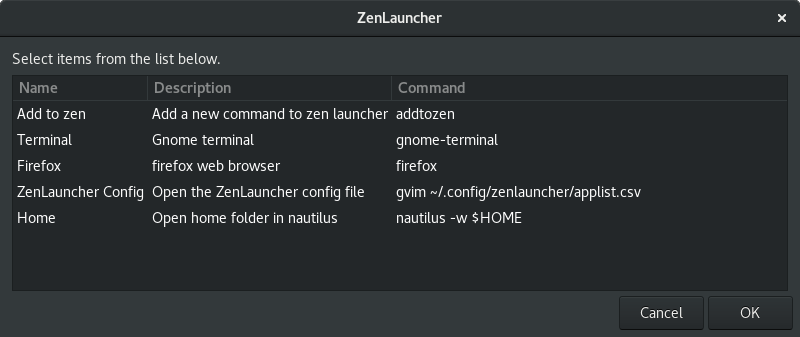

# ZenLauncher

A simple launcher to quickly execute commands and open apps.

Map the file to a global shortcut, something like Ctrl+Space

List of commands reside in ~/.config/zenlauncher/applist.csv
